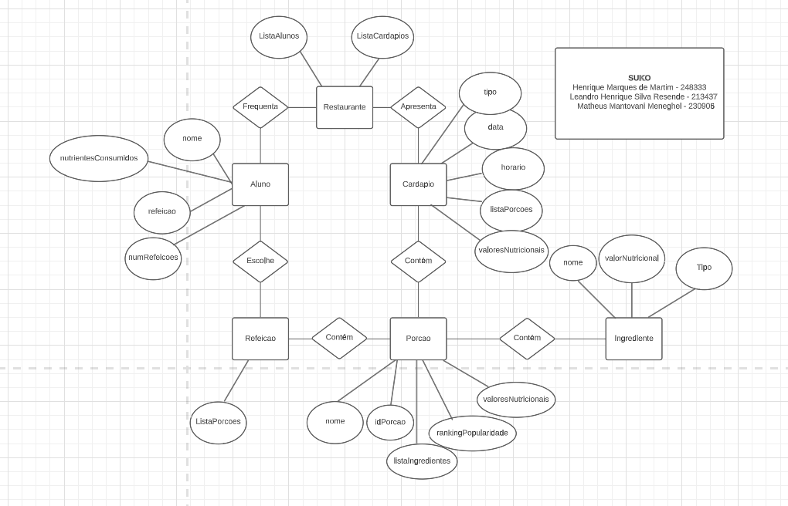

# Equipe `uniaovasko`

# Subgrupo `B`
* `Henrique Marques de Martim` - `248333`
* `Leandro Henrique Silva Resende` - `213437`
* `Matheus Mantovani Meneghel` - `230906`

## Modelo Conceitual ER Original

*Diagrama ER Original*

## Mapeamento para o Modelo Relacional

> Coloque aqui o modelo relacional que mapeia o modelo ER (original ou revisado). Nesse modelo deve constar o esquema das relações, com as chaves primárias e estrangeiras. A especificação de tipos de atributos é opcional.

> Exemplo de modelo lógico relacional
~~~
PESSOA(_Código_, Nome, Telefone)
ARMÁRIO(_Código_, Tamanho, Ocupante)
  Ocupante chave estrangeira -> PESSOA(Código)
~~~
