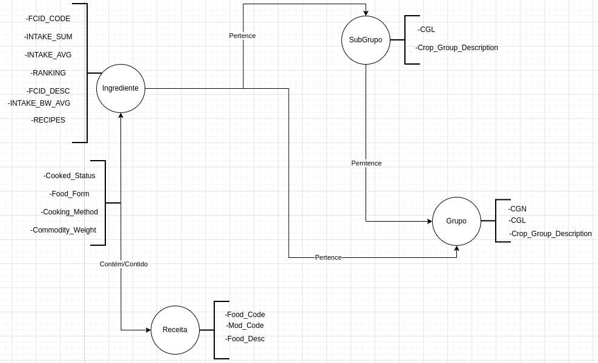

# Equipe `uniaovasko`

# Subgrupo `B`
* `Henrique Marques de Martim` - `248333`
* `Leandro Henrique Silva Resende` - `213437`
* `Matheus Mantovani Meneghel` - `230906`

# Modelo lógico preliminar de grafo

# Perguntas/Análises que podem ser implementadas pelo grafo
* Média de ingredientes por receita?
* Quais os subgrupos mais consumidos em peso?
* Grupos que tem maiores INTAKE_BW_AVG?
